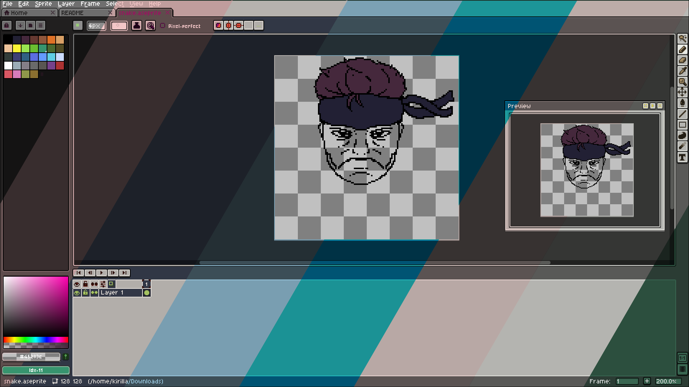

# Aseprite + wal

A tool to generate Aseprite themes with colorized UI from [pywal](https://github.com/dylanaraps/pywal) color schemes.



*Aseprite default theme made by David Capello*

## Requirements
- C++17 compiler
- [libpng](http://www.libpng.org/pub/png/libpng.html)
- [nlohmann/json](https://github.com/nlohmann/json)
- CMake
- [pywal](https://github.com/dylanaraps/pywal) (for generating color schemes)

## Building and installation
```sh
mkdir build
cd build
cmake ..
sudo make install
```

## Usage
```sh
aseprite-wal [options]
```

### Options
- `--colors PATH`      Path to pywal colors.json (default: `~/.cache/wal/colors.json`)
- `--template PATH`    Path to template directory (default: `~/.config/aseprite-wal/templates/light`)
- `--theme-path PATH`  Path to Aseprite extensions directory (default: `~/.local/share/Steam/steamapps/common/Aseprite/data/extensions/`)
- `--help`             Show help message

### Example
```sh
aseprite-wal --colors ~/.cache/wal/colors.json --template ~/.config/aseprite-wal/templates/light
```

## Integrating with Aseprite
1. Run `aseprite-wal` after generating a new pywal color scheme.
2. Restart Aseprite.
3. Go to Preferences > Extensions and enable `Aseprite Wal Theme`.
4. Go to Preferences > Themes and select `Aseprite Wal Theme - Your color scheme` theme.

